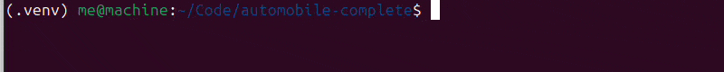
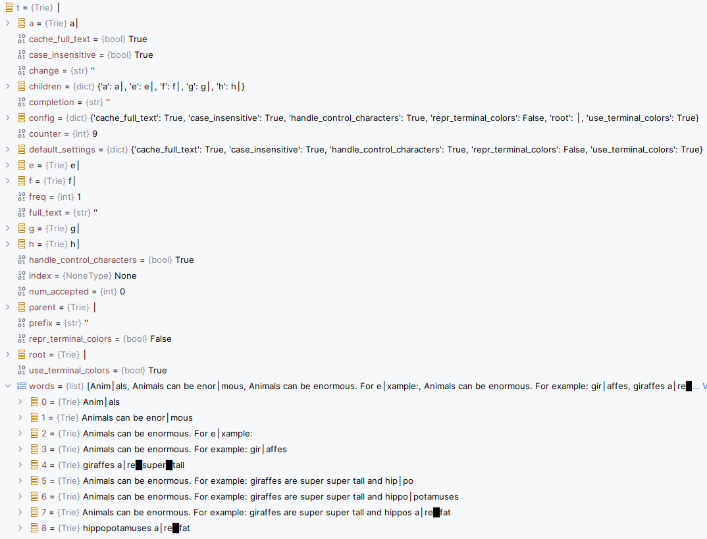

# Automobile Complete



Build your own **fast and dumb** offline autocomplete from a hardcoded wordlist.

1. Use our prebuilt word frequency list pulled from https://github.com/rspeer/wordfreq
2. Parse into a simple text format
3. Hardcode your own completions
```commandline
gir|affes
giraffes a|re super tall
```
4. run!

Currently available in Python, Typescript/Javascript/React Native/React Native Web.
Best used as a Chrome Extension.

## Quick Start

### Installation

```bash
# Clone the repository
git clone https://github.com/modularizer/automobile-complete
cd automobile-complete

# Install in editable mode
pip install -e .

# Setup react-native/js/chrome-extension
cd react-native-engine
npm install
npm run build
```

### Basic Usage
**Try it in the command line!:**
```bash
amc
```

**Try it in the browser!:**
I will publish to Chrome Web Store soon, in the meantime...

1. Go to chrome://extensions
2. Enable Developer mode
3. Load Unpacked `chrome-extension` folder
4. go to your favorite webpage and start typing

### How to use
The project ships with pre-generated wordlists and completion lists, so you can start using autocomplete immediately!

- Type to see inline gray text completions
- Press **Tab** to accept completions
- Press **Backspace** to delete characters
- Works with piped output (writes final result to stdout when piped)


### How to customize
**Only run setup if you've customized something:**
```bash
amc setup
```

Run `amc setup` if you've:
- Modified `.env` settings
- Added custom wordlists (e.g., `custom-words*.txt`)
- Added custom completion lists (e.g., `custom-completions*.txt`)
- Changed any configuration

This will regenerate wordlists and completion lists with your customizations.


### Console
Try running [demo.py](demos/py_console.py) in your console!
```python
from automobile_complete import Trie

if __name__ == "__main__":
    t = Trie.from_file("assets/merged-completionlist.txt")
    x = t.gira
    print(x)
```




### Console Typing Simulator
Try running `Trie.demo()` in your console
```python
from automobile_complete import Trie

if __name__ == "__main__":
    # the following is the same as Trie.demo()
    t = Trie.from_words("""
anim|als
enor|mous
for e|xample:
gir|affes
giraffes a|re super tall
hip|po
hippo|potamuses
hippos a|re fat
hippopotamuses a|re fat
    """, cache_full_text=True)
    t.sim("Animals can be enormo\t. For example: gira\t\b\bes are super super tall and hippos are fat",
          # disappearing=False
          )
```

### Customization

#### Adding Custom Words

Create a file named `custom-words.txt` (or any file matching `custom-words*`) in your project root:

```
my_custom_word #100
another_word #50
special_term
```

The `amc setup` command will automatically merge your custom words with the generated wordlist.

#### Adding Custom Completions

Create a file named `custom-completions.txt` (or any file matching `custom-completions*`) in your project root:

```
hel|lo #10
wor|ld #20
foo|bar #5
```

The `amc setup` command will automatically merge your custom completions with the generated completion list.

#### Configuration via `.env`

Copy `.env.sample` to `.env` and customize the settings:

```bash
cp .env.sample .env
```

Edit `.env` to change:
- File paths (where wordlists and completion lists are stored)
- Language settings (default: `en`)
- Thresholds and other processing parameters
- Default input/output files

All paths support:
- `~` for home directory expansion
- `%` for project root
- `|` for pipe-separated file alternatives (uses first existing file)

## Advanced Usage

### Individual Commands

If you need more control, you can run the steps individually:

```bash
# Generate wordlist
amc w

# Merge wordlists (automatically includes custom-words*.txt)
amc mw

# Generate completion list
amc c

# Merge completion lists (automatically includes custom-completions*.txt)
amc mc

# Run interactive autocomplete
amc
```

### Command Aliases

- `amc w` or `amcw` - Generate wordlist
- `amc mw` or `amcmw` - Merge wordlists
- `amc c` or `amcc` - Generate completion list
- `amc mc` or `amcmc` - Merge completion lists
- `amc` - Interactive autocomplete

### File Formats

**Wordlist Format** (`wordlist.txt`):
```
the #53703180
to #26915348
and #25703958
word_without_freq
```

**Completion Format** (`completionlist.txt`):
```
hel|lo #10
wor|ld #20
foo|bar
```

## How It Works

The system uses a **trie (prefix tree)** data structure where:
- Each node represents a prefix
- Shared prefixes share common nodes (efficient storage)
- Frequency statistics computed via depth-first search
- Auto-completion determined by frequency thresholds and ratios

When merging completion lists with conflicting paths (same prefix, different completions):
- Higher-weighted completion is kept
- Lower-weighted completion is disabled
- This ensures intelligent, context-aware autocomplete

## Requirements

- Python 3.8 or higher
- `wordfreq` library (automatically installed as a dependency)

## Project Structure

```
src/automobile_complete/
├── wordlist/          # Wordlist generation and merging
├── completionlist/    # Preprocess wordlists into completion lists
├── engine/            # Trie engine for interactive use
└── run/               # Interactive CLI runner
```

## Contributing
1. Feel free to take this and run with it - make it your own.
2. If you want to work together or have suggestions I am open to that too
3. Contact me at [modularizer@gmail.com](mailto:modularizer@gmail.com)

## License

This is free and unencumbered software released into the public domain.

See LICENSE file for details, or visit <https://unlicense.org>.
